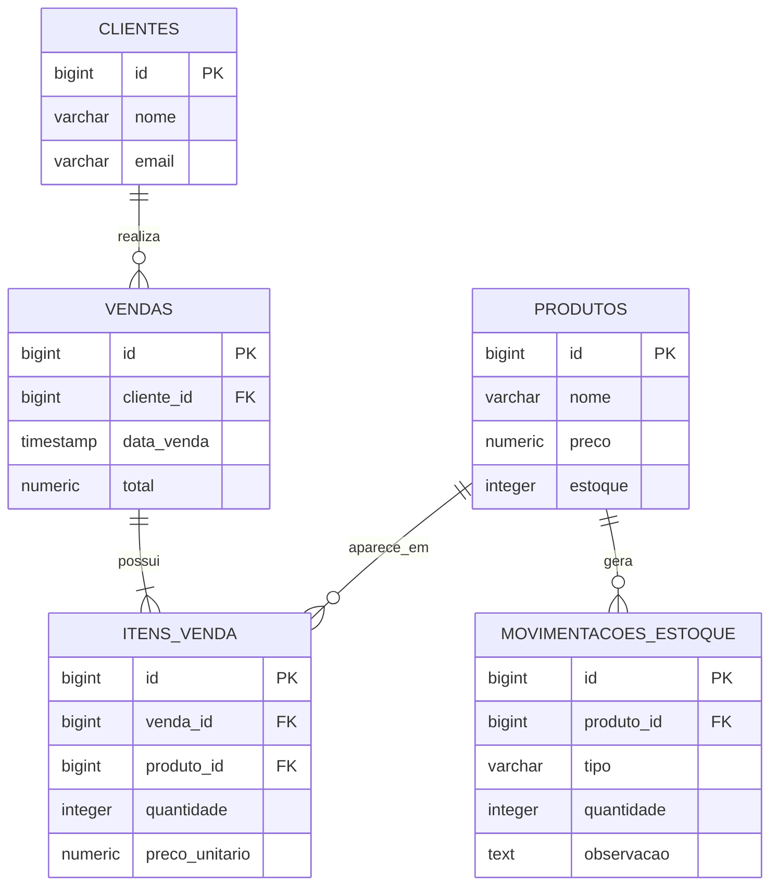

# Diagrama Entidade-Relacionamento

```mermaid
erDiagram
    CLIENTES ||--o{ VENDAS : realiza
    VENDAS ||--|{ ITENS_VENDA : possui
    PRODUTOS ||--o{ ITENS_VENDA : aparece_em
    PRODUTOS ||--o{ MOVIMENTACOES_ESTOQUE : gera

    CLIENTES {
        bigint id PK
        varchar nome
        varchar email
    }
    PRODUTOS {
        bigint id PK
        varchar nome
        numeric preco
        integer estoque
    }
    VENDAS {
        bigint id PK
        bigint cliente_id FK
        timestamp data_venda
        numeric total
    }
    ITENS_VENDA {
        bigint id PK
        bigint venda_id FK
        bigint produto_id FK
        integer quantidade
        numeric preco_unitario
    }
    MOVIMENTACOES_ESTOQUE {
        bigint id PK
        bigint produto_id FK
        varchar tipo
        integer quantidade
        text observacao
    }
```
